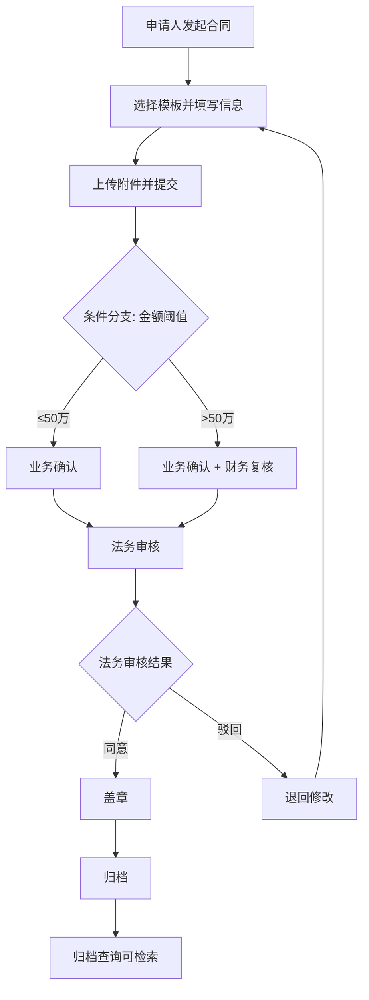

## 1. 产品概述

法务合同工作流编排平台，面向企业法务团队，规范合同从起草到归档的全生命周期审批流程。通过可视化流程设计器配置审批节点与条件分支，实现合同审批的标准化、可追溯和高效协作。

- 解决合同审批流程不规范、节点不可控、材料易遗漏等痛点
- 目标用户：企业法务团队、业务部门、财务部门及管理层

## 2. 核心功能

### 2.1 用户角色

| 角色 | 注册方式 | 核心权限 |
|------|----------|----------|
| 管理员 | 系统分配 | 配置流程、管理模板、查看统计 |
| 申请人 | 邮箱注册 | 发起合同流程、上传附件、催办审批 |
| 审批人 | 系统分配 | 同意、驳回、加签、填写修改意见 |
| 管理者 | 系统分配 | 按部门/金额/耗时/异常查看统计 |

### 2.2 功能模块

1. **流程设计器**：可视化拖拽节点、条件分支配置、办理人/时限/必填材料设置
2. **合同工作台**：发起流程、上传附件、查看当前节点、催办审批
3. **审批详情**：同意/驳回/加签、填写修改意见、查看审批轨迹
4. **模板中心**：合同模板管理、模板分类、模板预览与使用
5. **归档查询**：多条件检索已归档合同、查看合同详情与流程历史
6. **统计分析**：按部门/金额/耗时/异常节点的数据看板

### 2.3 页面详情

| 页面名称 | 模块名称 | 功能描述 |
|----------|----------|----------|
| 流程设计器 | 节点画布 | 拖拽添加起草/业务确认/法务审核/财务复核/盖章/归档等节点，连线定义流转方向 |
| 流程设计器 | 节点配置面板 | 设置节点名称、办理人角色、审批时限、必填材料清单 |
| 流程设计器 | 条件分支 | 配置金额阈值、部门条件等分支规则，自动路由至不同审批路径 |
| 合同工作台 | 流程发起 | 选择合同模板、填写合同信息、上传附件、提交审批 |
| 合同工作台 | 我的合同列表 | 查看已发起合同的当前状态、节点进度、操作催办 |
| 合同工作台 | 待办合同 | 查看待处理合同、快速进入审批 |
| 审批详情 | 审批操作 | 同意/驳回/加签操作、填写审批意见 |
| 审批详情 | 审批轨迹 | 时间轴展示每个节点的审批人、时间、意见 |
| 审批详情 | 附件查看 | 在线预览合同附件、补充上传材料 |
| 模板中心 | 模板列表 | 按分类浏览合同模板、搜索模板 |
| 模板中心 | 模板管理 | 新增/编辑/删除模板、设置模板字段 |
| 归档查询 | 检索面板 | 按合同编号/名称/部门/金额范围/日期范围筛选 |
| 归档查询 | 归档详情 | 查看归档合同全文、审批历史、附件下载 |
| 统计分析 | 部门统计 | 各部门合同数量、金额汇总、平均耗时 |
| 统计分析 | 异常看板 | 超时节点、驳回率、加签频次等异常指标 |
| 统计分析 | 趋势图表 | 合同量/金额的时间趋势、节点耗时分布 |

## 3. 核心流程

用户发起合同审批流程，经过配置的各审批节点流转，最终归档。管理员可在流程设计器中自定义节点和条件分支。审批人可在任意节点进行同意、驳回或加签操作。管理者可实时查看统计数据。

## 4. 用户界面设计

### 4.1 设计风格

- 主色调：深靛蓝 (#1B2A4A)，辅色：琥珀金 (#D4A843)，背景：暖灰白 (#F8F7F4)
- 按钮风格：圆角矩形，主操作按钮带微妙阴影，次要操作线框风格
- 字体：标题使用 Noto Serif SC（宋体风格权威感），正文使用 Noto Sans SC
- 布局风格：左侧固定导航栏 + 顶部面包屑 + 主内容区卡片式布局
- 图标风格：线性图标（Lucide），1.5px 描边，与文字等高对齐

### 4.2 页面设计概览

| 页面名称 | 模块名称 | UI 元素 |
|----------|----------|---------|
| 流程设计器 | 节点画布 | 白色画布背景、浅灰网格线、圆角矩形节点卡片、带箭头连线、拖拽交互 |
| 流程设计器 | 节点配置面板 | 右侧抽屉面板、表单字段、下拉选择、日期选择器 |
| 合同工作台 | 流程发起 | 居中表单卡片、步骤条指示器、文件拖拽上传区 |
| 合同工作台 | 合同列表 | 表格布局、状态徽章（彩色圆点+文字）、操作按钮组 |
| 审批详情 | 审批操作 | 顶部合同摘要卡片、中部审批操作区、底部时间轴 |
| 审批详情 | 审批轨迹 | 垂直时间轴、节点图标、状态色标、展开/折叠意见 |
| 模板中心 | 模板列表 | 网格卡片布局、分类侧边栏、搜索栏、模板预览缩略图 |
| 归档查询 | 检索面板 | 顶部筛选栏、结果表格、分页器、高级筛选折叠区 |
| 统计分析 | 数据看板 | 顶部指标卡片行、中部图表区（柱状图/折线图）、底部异常列表 |

### 4.3 响应式设计

- 桌面优先设计，最小宽度 1280px
- 平板适配（768px-1280px）：侧边栏可折叠，表格列自适应
- 移动端（<768px）：底部导航栏替代侧边栏，卡片单列布局
