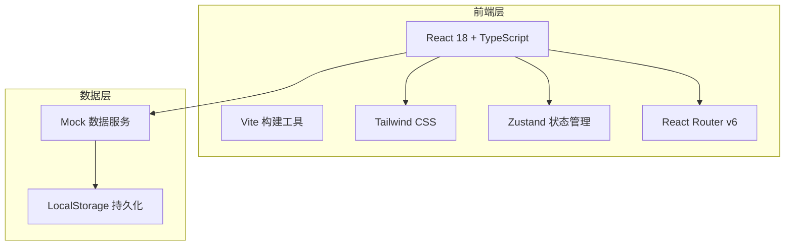
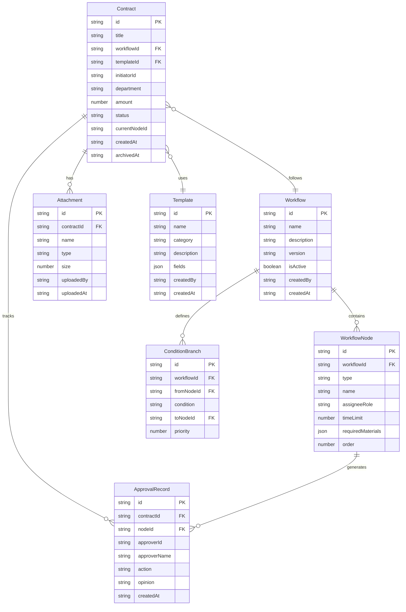

## 1. 架构设计



## 2. 技术说明

- 前端：React@18 + TypeScript + Tailwind CSS@3 + Vite
- 初始化工具：vite-init
- 后端：无（纯前端，使用 Mock 数据）
- 状态管理：Zustand
- 路由：React Router DOM v6
- 图表：Recharts
- 图标：lucide-react

## 3. 路由定义

| 路由 | 用途 |
|------|------|
| / | 首页仪表盘，概览统计 |
| /designer | 流程设计器，可视化编排节点 |
| /workspace | 合同工作台，发起与管理合同 |
| /workspace/create | 发起新合同流程 |
| /approval/:id | 审批详情，审批操作与轨迹 |
| /templates | 模板中心，合同模板管理 |
| /archive | 归档查询，检索已归档合同 |
| /statistics | 统计分析，数据看板 |

## 4. 数据模型

### 4.1 数据模型定义



### 4.2 核心类型定义

```typescript
type NodeType = "draft" | "business_confirm" | "legal_review" | "finance_review" | "stamp" | "archive" | "condition"

type ContractStatus = "draft" | "in_review" | "approved" | "rejected" | "stamped" | "archived"

type ApprovalAction = "approve" | "reject" | "add_signer" | "return_modify"

interface Workflow {
  id: string
  name: string
  description: string
  version: string
  isActive: boolean
  createdBy: string
  createdAt: string
  nodes: WorkflowNode[]
  branches: ConditionBranch[]
}

interface WorkflowNode {
  id: string
  workflowId: string
  type: NodeType
  name: string
  assigneeRole: string
  timeLimit: number
  requiredMaterials: string[]
  order: number
  position: { x: number; y: number }
}

interface ConditionBranch {
  id: string
  workflowId: string
  fromNodeId: string
  condition: string
  toNodeId: string
  priority: number
}

interface Contract {
  id: string
  title: string
  workflowId: string
  templateId: string
  initiatorId: string
  initiatorName: string
  department: string
  amount: number
  status: ContractStatus
  currentNodeId: string
  currentNodeName: string
  createdAt: string
  updatedAt: string
  archivedAt?: string
}

interface ApprovalRecord {
  id: string
  contractId: string
  nodeId: string
  nodeName: string
  approverId: string
  approverName: string
  action: ApprovalAction
  opinion: string
  createdAt: string
}

interface Attachment {
  id: string
  contractId: string
  name: string
  type: string
  size: number
  uploadedBy: string
  uploadedAt: string
}

interface Template {
  id: string
  name: string
  category: string
  description: string
  fields: TemplateField[]
  createdBy: string
  createdAt: string
  updatedAt: string
}

interface TemplateField {
  name: string
  label: string
  type: "text" | "number" | "date" | "select" | "textarea"
  required: boolean
  options?: string[]
}

interface UrgencyLog {
  id: string
  contractId: string
  urgenterId: string
  urgenterName: string
  targetNodeId: string
  message: string
  createdAt: string
}
```
